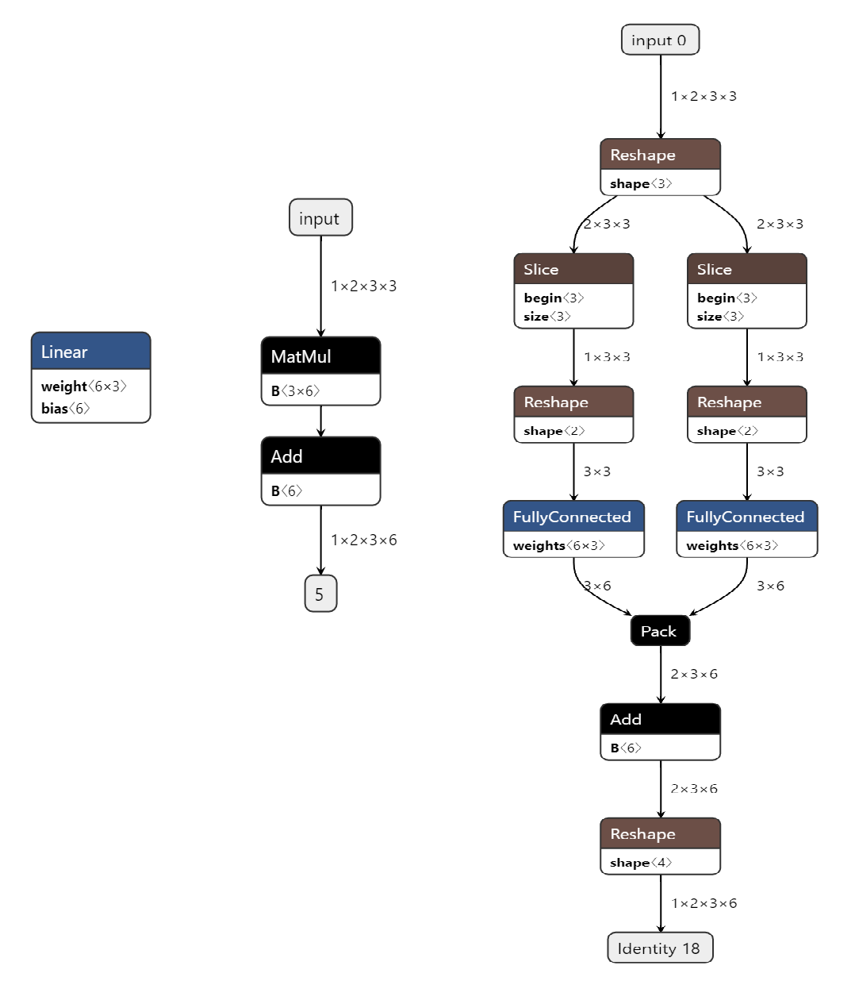
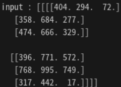
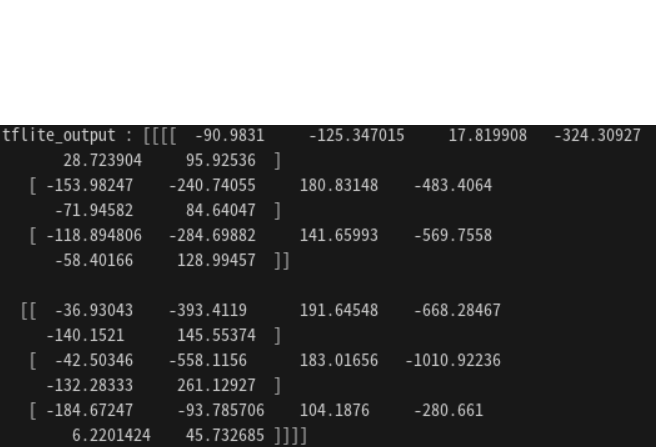
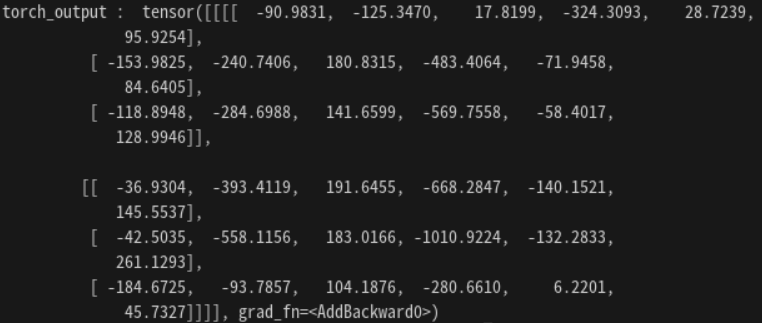

## 2023.09.07
* Generate Single Linear Operation
    ```Python
    import torch
    import torch.nn as nn


    # model
    class net_Linear(nn.Module):
        def __init__(self):
            super().__init__()
            self.op = nn.Linear(3, 6)

        def forward(self, input):
            return self.op(input)


    _model_ = net_Linear()

    # dummy input for onnx generation
    _dummy_ = torch.randn(1, 2, 3, 3)
    ```
* Linear model (torch -> onnx -> tf(그림 생략) -> tf.lite)<br>
    
    * 기본적인 Linear Operation 하나를 torch에서 tflite까지 변환
    * Linear가
        * torch -> onnx
            * Linear는 MatMul과 Add로 분리
            * 가중치 텐서의 모양도 조금 바뀌었다. (6,3) -> (3,6)
        * onnx -> tf -> tf.lite
            * 모델 모양이 많이 바뀌었다.
            * Reshape : 1x2x3x3을 2x3x3으로 바꿈
            * Slice : 2x3x3에서 1x3x3 1x3x3 두개로 쪼개서 FC에 연결
            * Reshape : 여전히 rank가 3이라서 랭크 2로 줄이기 위해
            * FullyConnected
            * Pack : 두 개로 나누었던 것들 다시 붙이고
            * Add : bias 더하기
            * Reshape : 다시 크기 맞추기
    * 정말로 변환이 잘되었는지, 확인하기 위해 샘플 입력 데이터로 추론한 결과를 비교해보자
        * input<br>
        <br>
        
        <br>
        * 결과치는 거의 동일하게 나왔다. 변환이 잘 된듯 하다.