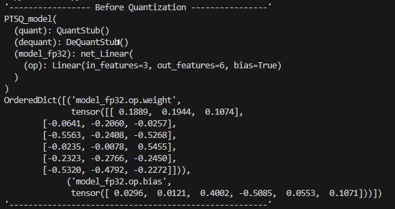
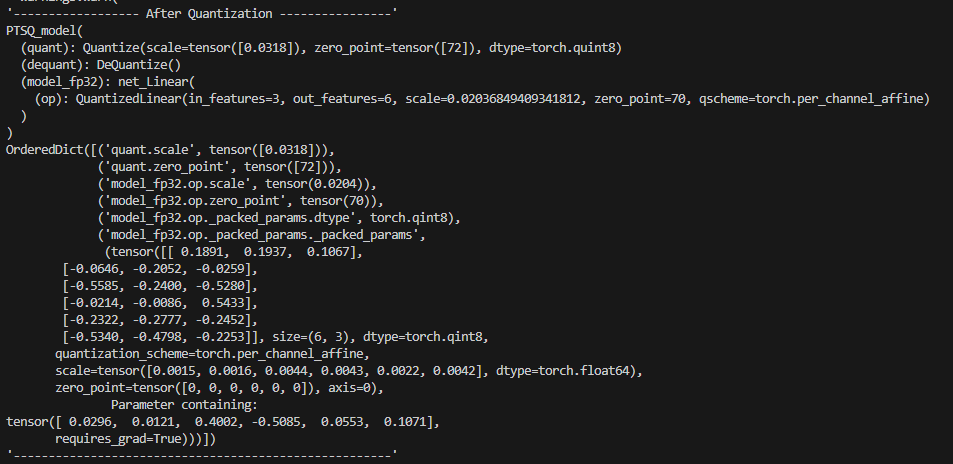
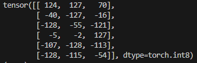
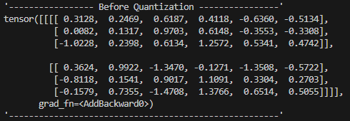
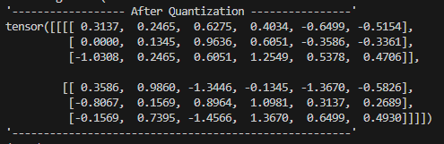
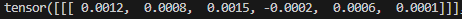

## 2023.09.10
* Quantize Single Linear Operation
    ```python
    import torch
    import torch.nn as nn
    from SingleLinear import net_Linear
    from pprint import pprint
    import numpy as np

    class PTSQ_model(nn.Module):
        def __init__(self, model):
            super(PTSQ_model, self).__init__()
            self.quant = torch.quantization.QuantStub()
            self.dequant = torch.quantization.DeQuantStub()
            self.model_fp32 = model
        
        def forward(self, x):
            x = self.quant(x)
            x = self.model_fp32(x)
            x = self.dequant(x)
            return x


    model = PTSQ_model(net_Linear())
    model.eval()
    quantization_config = torch.quantization.get_default_qconfig('fbgemm')
    torch.backends.quantized.engine = 'fbgemm'

    model.qconfig = quantization_config
    torch.quantization.prepare(model, inplace=True)

    sample_data = torch.randn(1, 2, 3, 3)

    with torch.no_grad():
        _ = model(sample_data)

    quantized_model = torch.quantization.convert(model, inplace=True)
    ```
* 양자화 된 이후의 모델과 양자화 전의 모델을 비교해보자<br>
    
    
    * scale과 zero_point는 잘 나오는 모습을 보면 양자화가 잘 되긴 한 것 같다. 하지만 왜 가중치는 여전히 float 형태일까?
        * 나와 같은 생각을 가진 사람이 고맙게도 질문을 올려줬다. (https://discuss.pytorch.org/t/would-the-weights-be-float-or-int/135185/3)
            * 요약하자면, print을 하기 위해 다시 dequantize를 한다고 한다. 그래서 float 형태를 띄고 있다.
            * 그렇다면 어떻게 정수형으로 보면 될까?
                ```python
                    qweights = quantized_model.state_dict()['model_fp32.op._packed_params._packed_params'][0]
                    print(qweights.int_repr())
                ```
                
                정수형으로 잘 양자화 되었다.
    * Linear의 MatMul 부분은 잘 양자화 되었지만, bias는 양자화 되지 않았다.

    * 양자화 전 후 추론 결과를 봐보자.(코드의 sample_data)<br>
        
        
        * 양자화 전 - 양자화 후 (1000개 랜덤 샘플에 대한 추론 오차 평균)<br>
        
    
