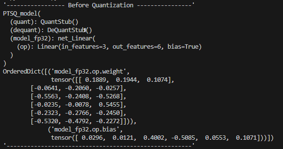
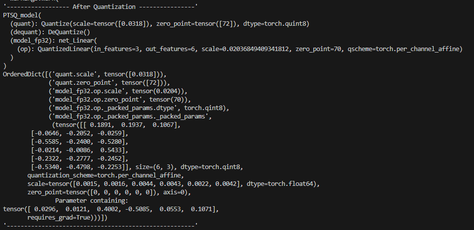

## 2023.09.11
### PyTorch2Circle
* ONE/res/PyTorchExamples에서 torch -> tflite로 변환한 tflite 사용
* 변환한 Operation은 앞에서 한 Single Linear Operation
    ```bash
    root@ssafy:/home/ssafy/one/res/PyTorchExamples/output# ../../../build/compiler/tflite2circle/tflite2circle Linear.tflite output.circle
    ```
    
* 전체적인 아키텍처와 가중치가 잘 변환되었다. (체크한 부분의 가중치)
* tflite와 circle이 똑같이 생겼다.
    * 멘토님의 말씀대로, TFLite와 circle이 거의 동일하다고 보면 될 듯 하다.

### Quantization Paramter 추출
* Single Linear Operation을 qint8로 양자화 한 모델에서 QParameter을 추출해보자.
    
    
    * Qparameter를 추출할 때, 결국엔 circle에서 이름도 바뀌고, Operation이 쪼개지기도 하는데, 어떻게 해야할까?