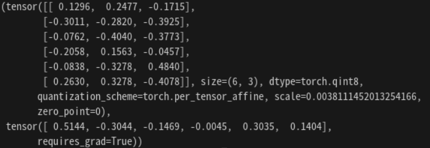

## 2023.09.12

### Quantization Parameter 추출
* 우정님 draft 코드 분석, 활용
* 기본적으로 추출은 잘 되지만, 명칭에 따라 안될 수도 있다.
    
    * 사진을 보면 model_fp32.op.weight가 아닌 model_fp32.op._packed_params.~ 로 나타나있다. 이는 PyTorch에서 양자화 후 경량화를 위해 두 가중치를 묶는(packed) 작업을 한다.
    * 묶여 있는 것을 풀어주기 준다면
    ```python
    def print_quantized_weights(model):
    for name, module in model.named_modules():
        if isinstance(module, nn.quantized.Linear):
            print(module._packed_params._weight_bias())
    ```
    
    * 첫번째 성분이 weight이고, 두번째 성분이 bias이다.
