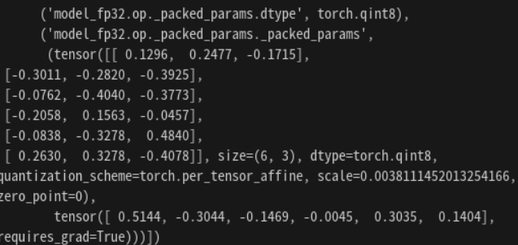

## 2023.09.13

### Extract Quantization Parameters from Single Linear Operation
* Linear의 경우, Quantization 이후 weight과 bias가 하나로 묶인다.
    
    * 위에서 보이는 _packed_params에서 weight와 bias 부분을 분리하자.
    ```python
    # 우정님의 TorchQParamExporter 에서 ...
    def __extract_module(self, module):
        tree = self.__tree
        for name, tensor in module.state_dict().items():
            layer = name[:name.rfind(".")]
            if layer.endswith("_packed_params"):
                layer = layer[:-15]

            if layer in tree:
                data = tree[layer]
            else:
                data = {}
                tree[layer] = data

            tensor_name = name[name.rfind(".") + 1:]
            if tensor_name == "_packed_params":
                data['weight'] = tensor[0]
                data['bias'] = tensor[1]
            else:
                data[tensor_name] = tensor
    ```
    * weight와 bias가 묶인다면, ~._packed_params.dtype과 ~._packed_params._packed_params로 묶여진다. 여기서 ~._packed_params._packed_params의 튜플 형태로 0번째 원소는 weight, 1번째 원소는 bias를 담고 있다. 이를 분리하고, ~.weight, ~.bias로 교체해주는 작업을 진행한다.
* weight와 bias를 분리한 후, 실행 결과를 본다면
    ```javascript
    {
        "quant": 
            {"scale": "0.npy", "zerop": "1.npy", "dtype": "int8"},
        "model_fp32.op.weight": 
            {"scale": "2.npy", "zerop": "3.npy", "value": "4.npy", "dtype": "int8"},
        "model_fp32.op": 
            {"scale": "5.npy", "zerop": "6.npy", "dtype": "int8"},
        "model_fp32.op.bias":
            {"scale": "5.npy", "zerop": "6.npy", "dtype": "int8", "value": "7.npy"}
    }
    ```
    * 정확하게 추출되었다.
    * 하지만 아직 tflite(or circle)과 이름이 맞지 않고, dtype을 사용자가 직접 넣어주었기 때문에, 이 부분까지 고쳐준다면 더욱 좋을 듯 하다.