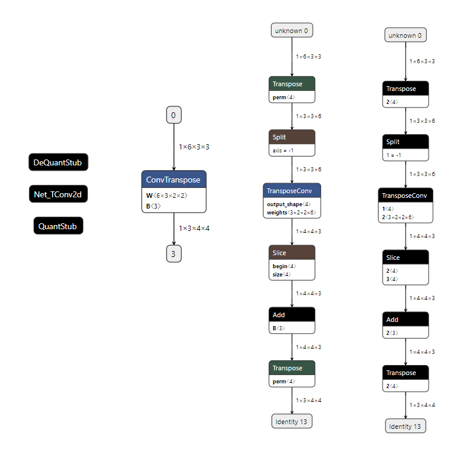

## 2023.09.19

### Extract Quantization Parameters from Single ConvTranspose2d Operation

```python
    import torch
    import torch.nn as nn

    class Net_TConv2d(nn.Module):
        def __init__(self):
            super().__init__()
            self.TConv2d = nn.ConvTranspose2d(6,3,2)
        
        def forward(self, x):
            x = self.TConv2d(x)
            return x
```
* Set backend and qconfig as qnnpack. (ConvTranspose2d 양자화에서 fbgemm or x86는 지원X PyTorch 1.7.0)
```python
    torch.backends.quantized.engine = 'qnnpack'
    model.qconfig = torch.quantization.get_default_qconfig('qnnpack')
```
* 변환 후에 대응하는 텐서에 가중치 값이 달라서 뭔가 했는데, 양자화를 진행한 후 mapping을 새로 만든 같은 모델이라서 가중치 값이 달라진 것이다.
    * 비교할 때나 테스트할 때, 까먹지 않고 챙겨야 할 부분


* (왼쪽부터 torch, onnx, tflite, circle)
* 텐서 값을 표시하지 않았지만, 같은 값을 가지고 있음

* Qparams
    * mapped qparams
    ```javascript
    {
        "unknown": 
            {"scale": "0.npy", "zerop": "1.npy", "dtype": "uint8", "quantized_dimension": 0}, 
        "Slice;PartitionedCall/Slice": 
            {"scale": "5.npy", "zerop": "6.npy", "dtype": "int8", "quantized_dimension": 0},
        "unknown_1": 
            {"scale": "5.npy", "zerop": "6.npy", "dtype": "int32", "value": "7.npy", "quantized_dimension": 0}
    }
    ```
    * not mapped qparams
    ```javascript
    {
        "model_fp32.TConv2d.weight": 
            {   
                "scale": "2.npy", 
                "zerop": "3.npy",
                "quantized_dimension": 0,
                "value": "4.npy",
                "dtype": "int8"
            }
    }
    ```
    * 중요한 weight 부분이 매핑이 안되었다. 쉐입이 바뀌어서 그런가
          * 참고로, Torch에서 Net_TConv2d.weight의 shape은 (6, 3, 2, 2)
