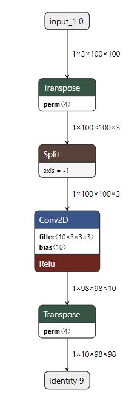
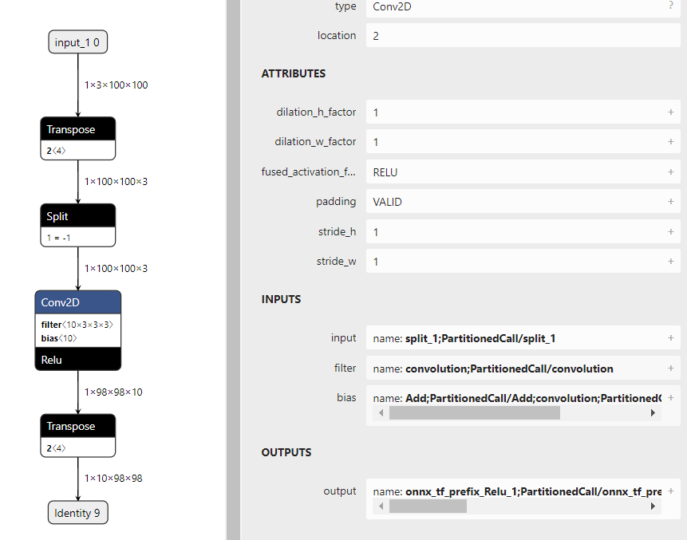
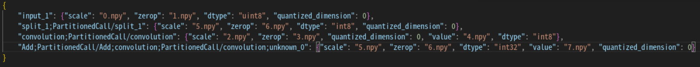
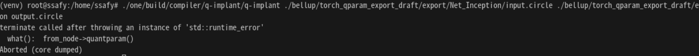

## 2023.09.26

### Inception Block 단위 테스트
* Extractor에서의 conv에 bias가 False일때는, Nonetype으로 extractor에서 에러가 난다. (__extract_module)
    * 하지만, torch -> tflite에서 bias는 생긴다...?
    
    * bias를 True로 한다면 extractor는 잘 작동한다.

* manual하게 BasicConv2d 블록을 양자화 후에 circle 변환 후 implant에 적용시켜보자.
    
    * input은 잘 매핑되었기 때문에, conv2d 부분만 직접 매핑해주자.
        
    * 
        * 에러가 뜬다....
        * 내일 우정님에게 여쭤봐야지