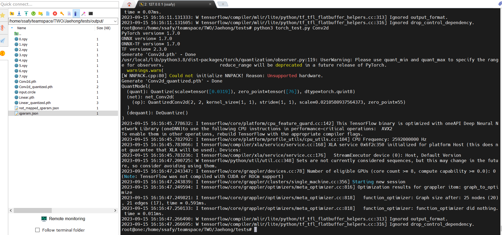

# 23.09.15 작업 내용

- Exporter 클래스가 너무 비대해짐

    -> Extractor와 Mapper로 분리할 필요가 생김

    - Mapper: Torch 모델을 Circle 모델과 매핑하여 다시 이름을 붙인 Dict 반환
    - Extractor: Circle로 매핑된 Dict에서 실제로 qparams를 생성

    - Exporter에는 2개의 메서드만 남기고, 나머지는 기능에 따라 따로 나눠 넣었다.

    - `qdtype_mapping`은 변하지 않는 값을 매핑해 넣은 것이므로 고유할 필요가 없다 -> cls variable로 전환

    

- 실행 결과

    - `export_main.py` pass

    - `torch_test.py`: Conv2d pass

    

## TODO

- 다른 함수들을 돌려보면서 실행 성공 여부를 확인해볼 필요가 있다.

- `tflite2circle` 경로를 알아서 찾아오게 해야 한다.

- `./nncc test`로 스크립트를 실행시킬 수 있도록 한다.
