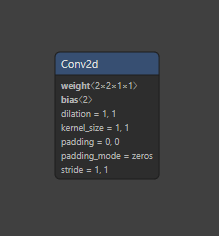
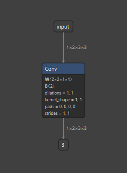
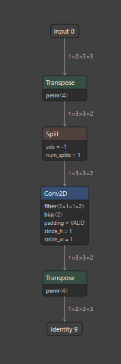
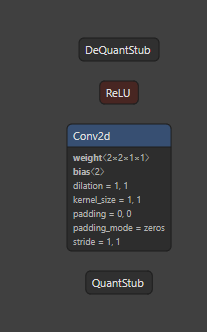
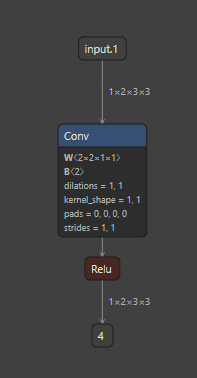
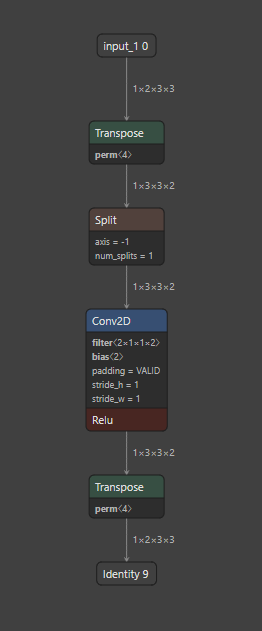

# Torch to Circle

Pytorch Model Quantization에서 진행한 두가지 원본 모델에 대한 변환을 진행합니다.

변환은 ONE/res/PyTorchExamples/ptem.py 를 사용합니다.

ONE/res/PyTorchExamples/examples 안에 디렉토리를 새로 만들고

`__init__.py` 를 만들어서 그 안에 코드를 담습니다.

이때 ONNX로 변환하기 위해 dummy data를 사용합니다.

#### `ONEforALL_Conv2d/__init__.py`

```python
import torch
import torch.nn as nn

class SingleConvModel(nn.Module):
    def __init__(self, in_channels, out_channels, kernel_size):
        super(SingleConvModel, self).__init__()
        self.conv = nn.Conv2d(in_channels, out_channels, kernel_size)

    def forward(self, x):
        x = self.conv(x)
        return x

in_channels = 2
out_channels = 2
kernel_size = 1

_model_ = SingleConvModel(in_channels, out_channels, kernel_size)


#dummy
_dummy_ = torch.randn(1, 2, 3, 3)

```

#### `ONEforALL_Conv2d_For_Static/__init__.py`

```python

import torch

# define a floating point model where some layers could be statically quantized
class M(torch.nn.Module):
    def __init__(self):
        super().__init__()
        # QuantStub converts tensors from floating point to quantized
        self.quant = torch.quantization.QuantStub()
        self.conv = torch.nn.Conv2d(2, 2, 1)
        self.relu = torch.nn.ReLU()
        # DeQuantStub converts tensors from quantized to floating point
        self.dequant = torch.quantization.DeQuantStub()

    def forward(self, x):
        # manually specify where tensors will be converted from floating
        # point to quantized in the quantized model
        x = self.quant(x)
        x = self.conv(x)
        x = self.relu(x)
        # manually specify where tensors will be converted from quantized
        # to floating point in the quantized model
        x = self.dequant(x)
        return x

_model_ = M()

#dummy
_dummy_ = torch.randn(1, 2, 3, 3)


```

산출물은 output 디렉토리 참조.


## Netron 

ONEforALL_Conv2d.pth



ONEforALL_Conv2d.onnx



ONEforALL_Conv2d.tflite



ONEforALL_Conv2d_For_Static.pth



ONEforALL_Conv2d_For_Static.onnx



ONEforALL_Conv2d_For_Static.tflite

